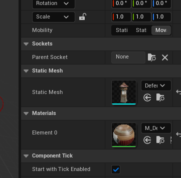
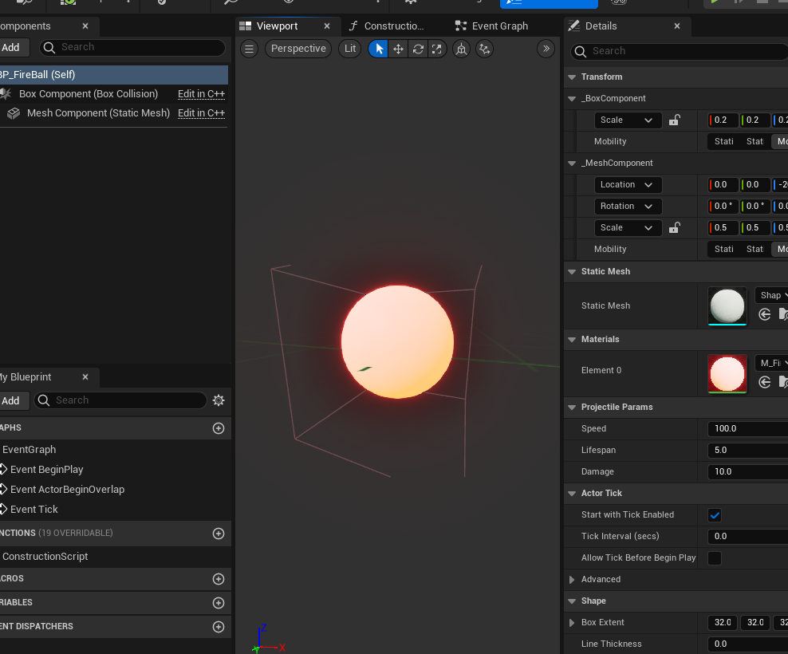
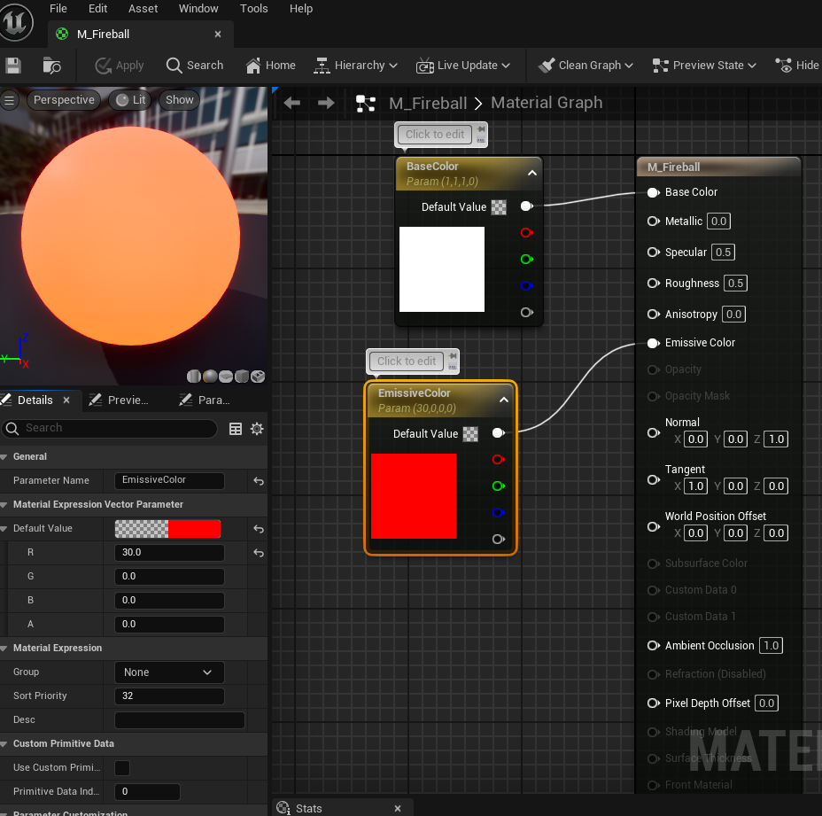
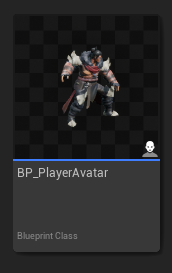
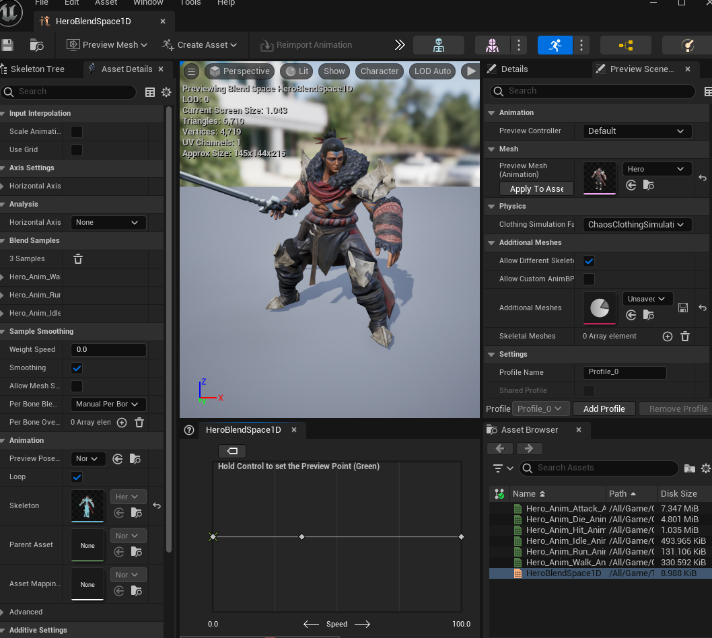
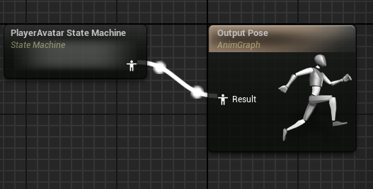
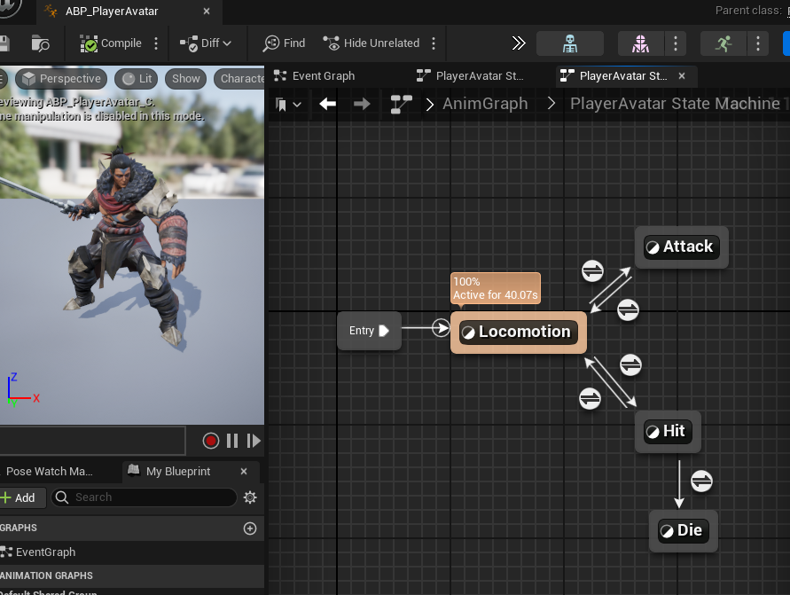

Learning and Creating Pangaea  
---
 

---

---

## Getting Started  

---
 
---

 

* Open Unreal Engine. 
* Choose Games.  
* Choose the "Top Down" game option. 
* Change "Blueprint" to "C++" option. 

 
 

---
### Setting Up a New C++ Class

---
 
---
 

* First thing that was covered was setting up a "New C++ Class".  
* C++ Classes allow you to create a new base that is tailored to your exact need that can be used then in blueprints. 
* The 1st new c++ class I created in Pangaea was a defense tower.
    * right-click in the Pangaea C++ folder and choose New C++ Class
    * Next choose Actor under the common classes, select next.
    * Leave the Public and Private buttons unselected
    * Name field type: DefenseTower
    * Spelling is important, if you misspell something in this step you are stuck with it.
    * Hit create.
        * You should now be able to find your new class in the Pangaea C++ Folder,
          if you don't save and quit and reload the game. This is where I had difficulties
          as I often forgot to check.

 
 

### Coding DefenseTower in Ryder

---
 
---
 

* When coding we always start with the header file. It will contain the "name of your file" followed by ".h"  
* 1st thing that should always be added to this file is "#pragma once", it helps the compiler not freakout if there are redundancies. 
* Here you can take a look at the code I used for the header file:

> Defense tower header file: [DefenseTower.h](Files/DefenseTower.h)  
> 
* For now we leave the Source file or ".cpp" file alone.

 
 

---
## Having Build Issues  

### Switching Tactics  

---
 

So, I am having difficulties with getting my build to work in unreal.  
I also am having difficulties trying to get videos in here.  
So, I am going to go over how far I got before the project went to a mangled mess,  
and some key things in each blueprint/lesson that I felt was useful knowledge for me. 

##  DefenseTower  

---

 
---
 

* For almost every new class that you are adding into the game you will need to files. 
A header file also known as ".h" file, and a constructor file also known as ".cpp" file. 
I will share both of them here as text files.  
I made it to about page 205 in the book before the game just refused to compile and I gave up on trying to sort out what was broken.  

> Defense tower header file where I stopped at: [Defense Header File](Files/ADefenseTower.h.txt)  
> Defense tower constructor file: [Defense Constructor File](Files/DefenseTower.cpp.txt)  
> 
---
 
---
---
<txt height="60%" width="60%"/> 
Important thing to remember to adjust is the sphere radius of the SphereCollisionComponent. 
If you forget this your tower will have a tiny attack radius as that is what it will be used for. 
 

---
 
---
---
<txt height="60%" width="60%"/>
Remember to add your choice of static mesh and the material in the blueprint. 
 
   
 

## Making Projectile class

---
 
---
<txt height="50%" width="50%"/>

>Projectile Header file: [Projectile.h](Files/Projectile.h.txt)   
>Projectile Constructor file: [Projectile.cpp](Files/Projectile.cpp.txt)  
 

  
---
<txt height="50%" width="50%"/> 
Fireball Material Blueprint 
   
   

<txt height="100%" width="100%" />

## APlayerAvatar Class

---
  
---
 
<txt height="100%" width="100%" />

* This new cpp blueprint will be added as a character, doing so allows for a skeletal mesh, 
movement, and a capsule. 

>APlayerAvatar Header file: [APlayerAvatar.h](Files/PlayerAvatar.h.txt)   
>APlayerAvatar Constructor file: [APlayerAvatar.cpp](Files/PlayerAvatar.cpp.txt)  
 

   

* Whenever adding something new into the game you should be compiling your build.  
* At certain times the game will not build out because it is missing a component that has been added yet, or something that you just added that needs more detail.
But it is always a good idea to try, because it will give you the file and line that is stopping the build most of the time. 
 

---
## PlayerAvatarAnimInstance  

---
  
---
 
<txt height="100%" width="100%" />

* This new cpp blueprint will be added as an AnimInstance. 

>PlayerAvatarAnimInstance Header file: [PlayerAvatarAnimInstance.h](Files/PlayerAvatarAnimInstance.h.txt)   
>PlayerAvatarAnimInstance Constructor file: [PlayerAvatarAnimInstance.cpp.txt](Files/PlayerAvatarAnimInstance.cpp.txt)  
 

* Part created a unique set of challenges as the book was not very clear and 
there were additional steps that were needed outside of the cpp blueprints. 
* You have to create an ABP_PlayerAvatar (Animation|Animation Blueprint) blueprint 
to make it work. 
* Using the PlayerAvatarAnimInstance class you just create, to make the blueprint. 
* You will then need to make a Blend Space 1D asset to use in your state machine in the blueprint. 
* Naming the horizontal axis "Speed" and adding in key point markers for the idle at 0,
walk about a 1/3 the distance away from the last one, and at the end a fast walk or run. 

---
  
---
<txt height="100%" width="100%" />
Example of the State Machine 

---
  
---
<txt height="100%" width="100%" />
Here is the hero's state machine, 
it's very simple and of course the more you expand your 
character the more complex it will be. 

 
   

---
>Previous: [Beginning](/7255Fall2024/README.md) |
>Next: [PowerUps](PowerUps/PowerUps.md)
---