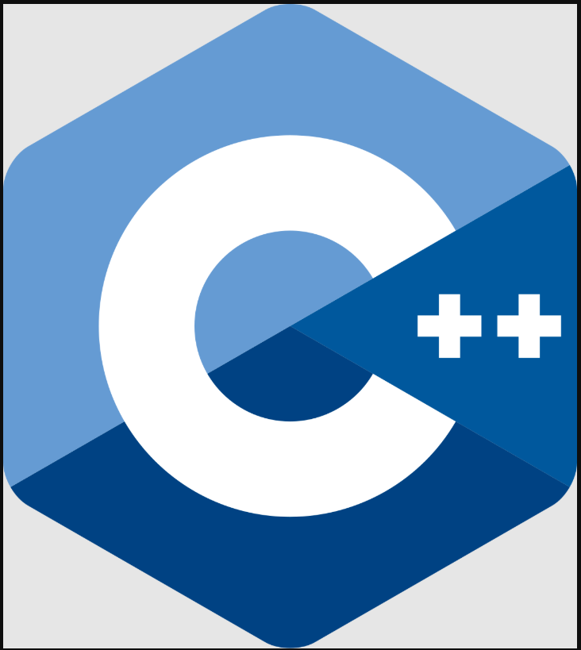
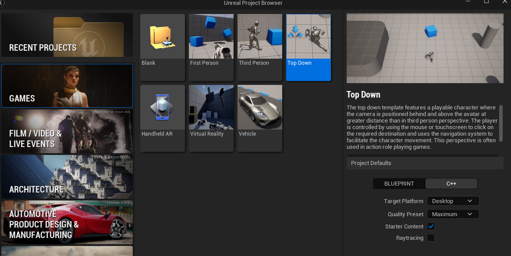
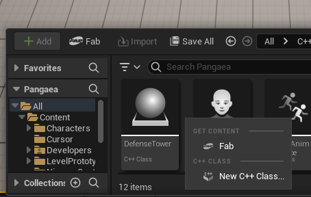
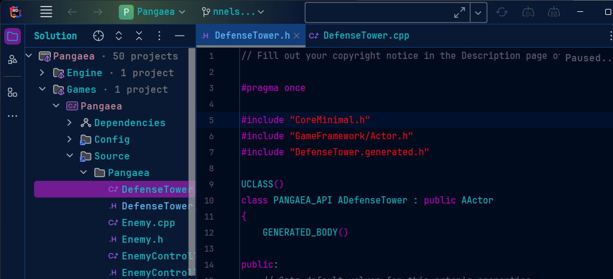
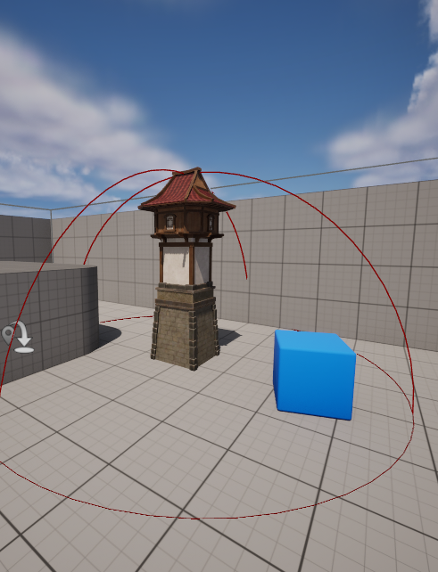
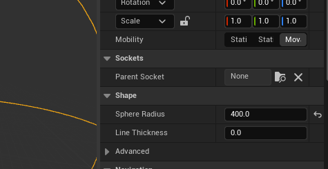

Learning and Creating Pangaea  
---
 

---

---

## Getting Started  

---
 
---

 

* Open Unreal Engine. 
* Choose Games.  
* Choose the "Top Down" game option. 
* Change "Blueprint" to "C++" option. 

 
 

---
### Setting Up a New C++ Class

---
 
---
 

* First thing that was covered was setting up a "New C++ Class".  
* C++ Classes allow you to create a new base that is tailored to your exact need that can be used then in blueprints. 
* The 1st new c++ class I created in Pangaea was a defense tower.
    * right-click in the Pangaea C++ folder and choose New C++ Class
    * Next choose Actor under the common classes, select next.
    * Leave the Public and Private buttons unselected
    * Name field type: DefenseTower
    * Spelling is important, if you misspell something in this step you are stuck with it.
    * Hit create.
        * You should now be able to find your new class in the Pangaea C++ Folder,
          if you don't save and quit and reload the game. This is where I had difficulties
          as I often forgot to check.

 
 

### Coding DefenseTower in Ryder

---
 
---
 

* When coding we always start with the header file. It will contain the "name of your file" followed by ".h"  
* 1st thing that should always be added to this file is "#pragma once", it helps the compiler not freakout if there are redundancies. 
* Here you can take a look at the code I used for the header file:

> Defense tower header file: [DefenseTower.h](Files/DefenseTower.h)  
> 
* For now we leave the Source file or ".cpp" file alone.

 
 

## Having Build Issues  
---

### Switching Tactics  
---
 

So, I am having difficulties with getting my build to work in unreal.  
I also am having difficulties trying to get videos in here.  
So, I am going to go over how far I got before the project went to a mangled mess,  
and some key things in each blueprint/lesson that I felt was useful knowledge for me. 

##  DefenseTower  
---

---
 
---
 

* For almost every new class that you are adding into the game you will need to files. 
A header file also known as ".h" file, and a constructor file also known as ".ccp" file. 
I will share both of them here as text files.  
I made it to about page 205 in the book before the game just refused to compile and I gave up on trying to sort out what was broken.  

> Defense tower header file where I stopped at: [Defense Header File](Files/ADefenseTower.h.txt)  
> Defense tower constructor file: [Defense Constructor File](Files/DefenseTower.cpp.txt)  
> 
---
 
---
   
   

## Title

---
 
---
 

* 1  
   
   

## Title

---
 
---
 

* 1  
* 2  
* 3  
   
   

---
## Title  

---
>Previous: [Beginning](/7255Fall2024/README.md) |
>Next: [PowerUps](PowerUps/PowerUps.md)
---