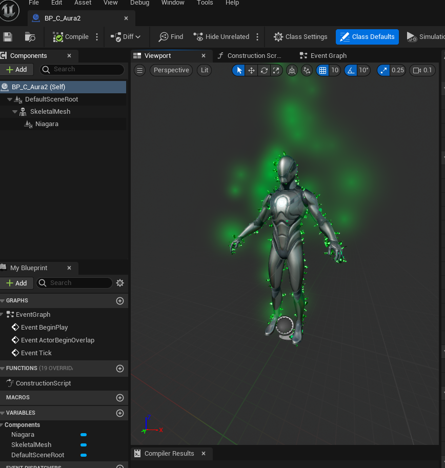

# PowerUps  
---

 

 
 

---

## PowerUps   
 
---
 
 

* I had power ups working in the game before adding in the 
weapons afterwards it broke the game so I commented most of it out.  
* I have a 2nd project that I am attempting to get it to work in, but I was a 
lot more focused on making the power material and components. 
* I plan on continuing this part of the project over the break and 
adding more it here and the videos to my wix page. 
 

>PowerUps Header file: [PowerUps.h](Files/PowerUp.h.txt)  
>PowerUps Constructor file: [PowerUps.cpp](Files/PowerUp.ccp.txt)  
 

 

---
>Previous: [CreatingPangaea](/7255Fall2024/CreatingPangaea/CreatingPangaea.md) |
>Next: [Extra](Extra/Extra.md)
---