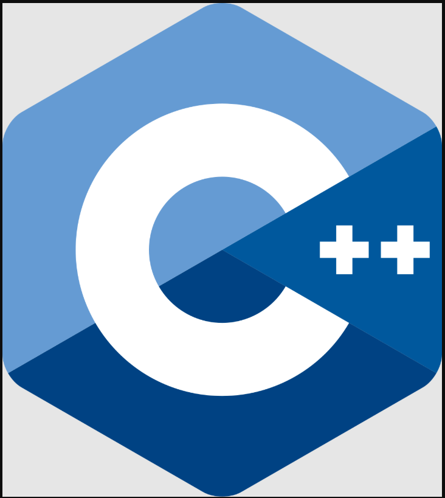

# N.Nelson's Adventures into Learning C++ for Unreal Engine

---

## DMAE 7255  
### (Advanced Programming part 2)

 

---

<!-- TOC --> 

<kbd></kbd> &nbsp;&nbsp; [Lessons Learned while trying to create Pangaea](CreatingPangaea/CreatingPangaea.md) 

<kbd></kbd> &nbsp;&nbsp; [Power Ups C++](CreatingPangaea/PowerUps/PowerUps.md)  

<kbd></kbd> &nbsp;&nbsp; [Everything Else](CreatingPangaea/PowerUps/Extra/Extra.md)  

 
 

---
>Next: [Lessons Learned while trying to create Pangaea](CreatingPangaea/CreatingPangaea.md)

---
<!-- LICENSE -->

License

Distributed under the MIT License. See `LICENSE` for more information:
<link> [License](LICENSE) <link/>

Dev Tips

Big Thanks and shoutout to my Advanced Programming teacher for always putting  
out chill energy and helping me find bugs and explaining how to find and fix  
them in a way that made better sense to my brain.  
And a shoutout to Marc Aubanel for sending me his basic GitHub Lesson Template  

 

 
 

